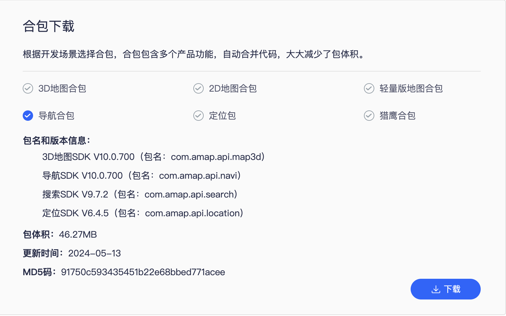
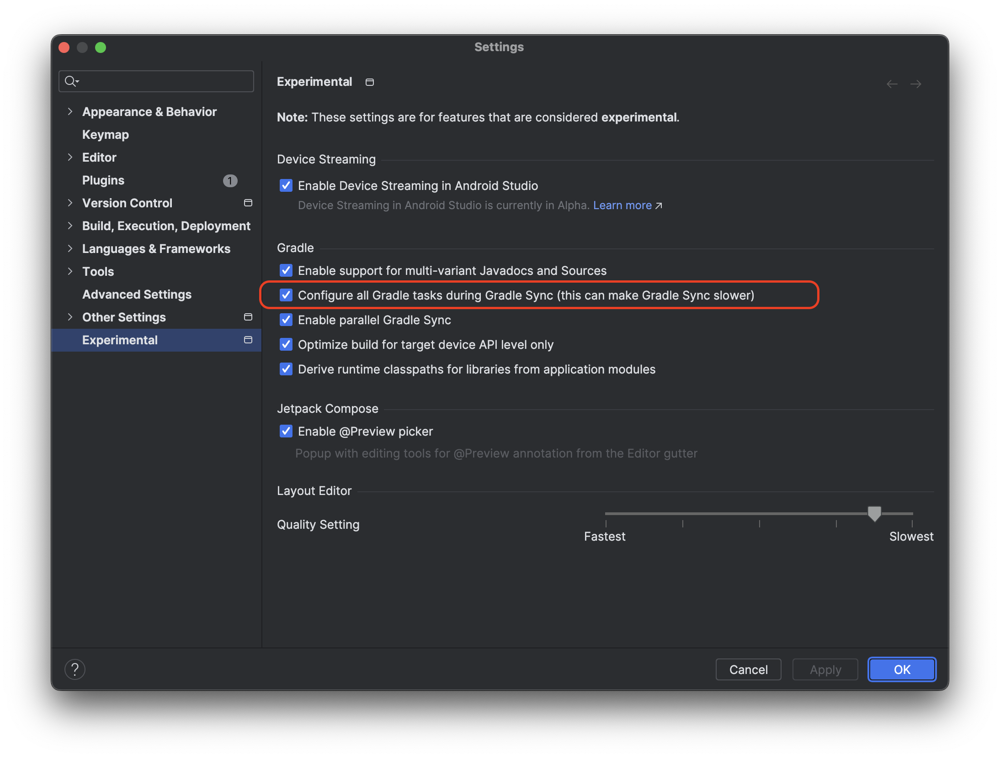
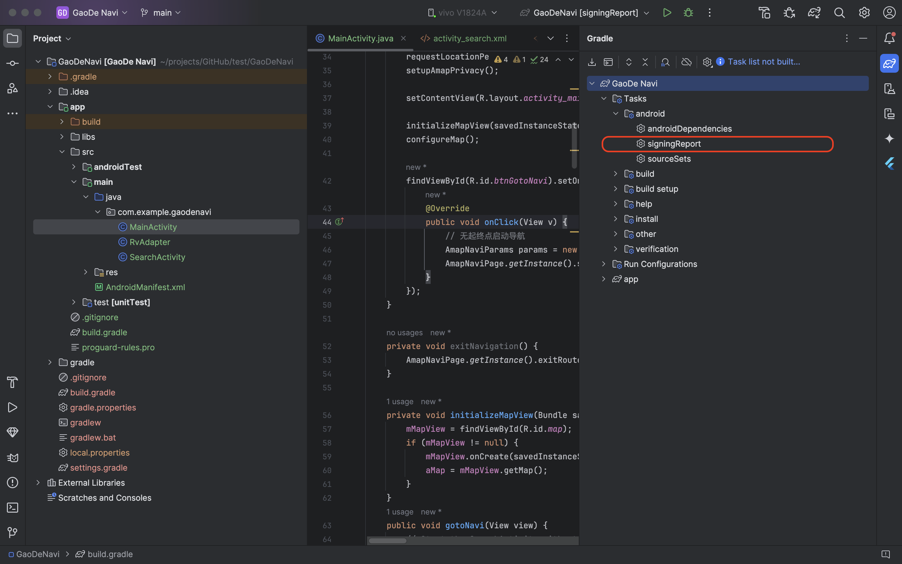
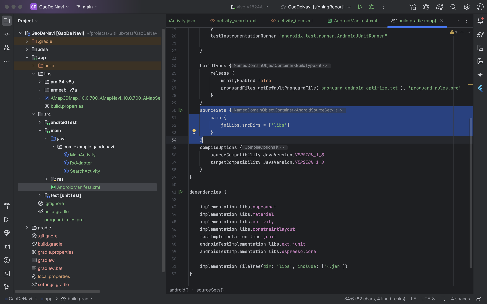
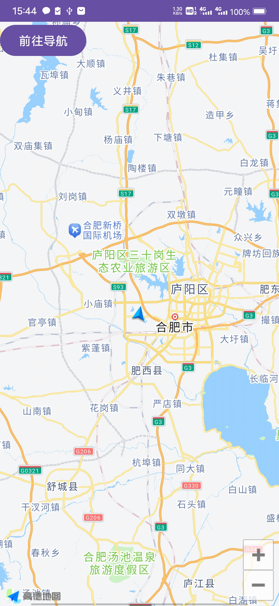
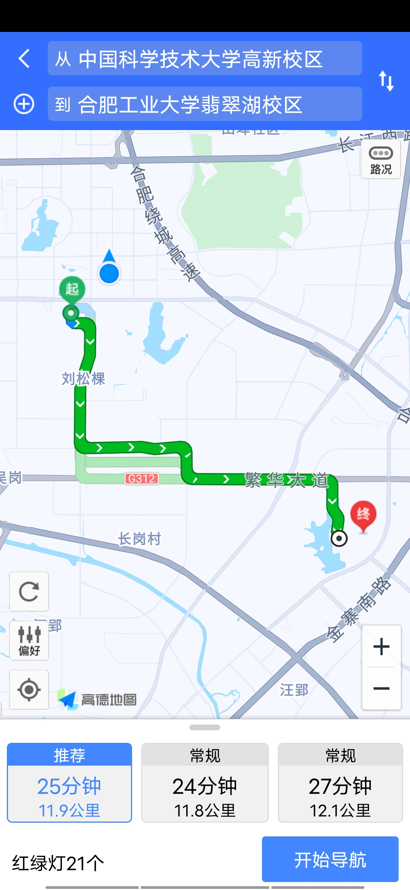

# 使用高德SDK实现导航功能

[参考博客](https://blog.csdn.net/weixin_46974030/article/details/134059600)  

更好观感：[我的博客](https://blog.whff521.xyz/2024/06/21/2024%E5%B9%B4Android%E9%A1%B9%E7%9B%AE%E5%AE%9E%E7%8E%B0%E9%AB%98%E5%BE%B7%E5%AF%BC%E8%88%AA/)  

这是今天企业实训的一个小作业，实际上我从昨天就开始尝试申请key然后下载官方Demo开始实验。本来是要做flutter项目，但是高德官方里flutter教程只有显示地图和定位功能，没有导航功能，导航功能官方只有Android的教程。今天也是用Android原生进行编写的。至于怎么整合到flutter项目里目前还不知道。。。

## 1. 官网下载SDK
我也尝试过直接gradle引入包的操作，但是直接引入的会缺少`AmapNaviParams`。官网也一直强调有个什么东西开源了所以提供的包里移除了一些东西（不知道到底是什么）。  

[官网SDK下载地址](https://lbs.amap.com/api/android-sdk/download)  

我下载的是导航合包：

  

## 2. 创建项目 

直接Android Studio创建一个java，Groovy的项目即可。  

设置里需要设置生成所有Gradle Task：  

  

这样你就可以靠点击这里直接获得你项目的SHA1的值，申请key的时候需要这个。

  

点击上图位置你就可以在终端看见你的SHA1值。在我这里release和debug的SHA1的值是一样的。  

## 3. 导入你下载的SDK

在app的`build.gradle`的`dependencies`里添加一行
`implementation fileTree(dir: 'libs', include: ['*.jar'])`  

在上方和`compileOptions`同级的位置添加：

```
sourceSets {
    main {
        jniLibs.srcDirs = ['libs']
    }
}
```
如图：

  

同时下载的SDK如图放在app文件夹下的libs文件夹下。

同步一下即导入完成。

## 添加权限和你的KEY
这里需要在manifest文件里添加一些权限，你的key和一个服务。

```xml
    <!--允许访问网络，必选权限-->
    <uses-permission android:name="android.permission.INTERNET" />

    <!--允许获取粗略位置，若用GPS实现定位小蓝点功能则必选-->
    <uses-permission android:name="android.permission.ACCESS_COARSE_LOCATION" />

    <!--允许获取设备和运营商信息，用于问题排查和网络定位，若无gps但仍需实现定位小蓝点功能则此权限必选-->
    <uses-permission android:name="android.permission.READ_PHONE_STATE" />

    <!--允许获取网络状态，用于网络定位，若无gps但仍需实现定位小蓝点功能则此权限必选-->
    <uses-permission android:name="android.permission.ACCESS_NETWORK_STATE" />

    <!--允许获取wifi网络信息，用于网络定位，若无gps但仍需实现定位小蓝点功能则此权限必选-->
    <uses-permission android:name="android.permission.ACCESS_WIFI_STATE" />

    <!--允许获取wifi状态改变，用于网络定位，若无gps但仍需实现定位小蓝点功能则此权限必选-->
    <uses-permission android:name="android.permission.CHANGE_WIFI_STATE" />

    <!--允许写入扩展存储，用于数据缓存，若无此权限则写到私有目录-->
    <uses-permission android:name="android.permission.WRITE_EXTERNAL_STORAGE" />

    <!--允许读设备等信息，用于问题排查-->
    <uses-permission android:name="android.permission.READ_EXTERNAL_STORAGE" />

    <!--允许访问网络，必选权限-->
    <uses-permission android:name="android.permission.INTERNET" />

    <!--允许读设备等信息，用于问题排查-->
    <uses-permission android:name="android.permission.READ_PHONE_STATE" />

    <!--允许获取网络状态-->
    <uses-permission android:name="android.permission.ACCESS_NETWORK_STATE" />

    <!--允许获取wifi网络信息-->
    <uses-permission android:name="android.permission.ACCESS_WIFI_STATE" />

    <!--允许写入扩展存储，用于搜索结果缓存，若无此权限则写到私有目录-->
    <uses-permission android:name="android.permission.WRITE_EXTERNAL_STORAGE" />

    <!--允许读设备等信息，用于问题排查-->
    <uses-permission android:name="android.permission.READ_EXTERNAL_STORAGE" />
    <uses-permission android:name="android.permission.ACCESS_FINE_LOCATION" />
    <uses-permission android:name="android.permission.ACCESS_COARSE_LOCATION" />
```
然后application下添加你的key和一个服务，之后还要用到一个高德自己的activity，这里顺便一起声明了,这些和你的启动Activity是同级的：  

```xml
<meta-data android:name="com.amap.api.v2.apikey" android:value="你的key">
</meta-data>
<service android:name="com.amap.api.location.APSService"></service>
<activity
    android:name="com.amap.api.navi.AmapRouteActivity"
    android:theme="@android:style/Theme.NoTitleBar"
    android:configChanges="orientation|keyboardHidden|screenSize|navigation" />
```

## 展示图 
<div style="display: flex;gap: 10px;">
  
  
</div>

## 相对于参考博客做的代码替换

由于有一些APi在最新的SDK中已经失效，这里重点写一下相对于参考博客代码中的不同：

MainActivity中：
```java
private void configureMap() {
        if (aMap == null) return;
        MyLocationStyle myLocationStyle;
        myLocationStyle = new MyLocationStyle();//初始化定位蓝点样式类myLocationStyle.myLocationType(MyLocationStyle.LOCATION_TYPE_LOCATION_ROTATE);//连续定位、且将视角移动到地图中心点，定位点依照设备方向旋转，并且会跟随设备移动。（1秒1次定位）如果不设置myLocationType，默认也会执行此种模式。
        myLocationStyle.interval(2000); //设置连续定位模式下的定位间隔，只在连续定位模式下生效，单次定位模式下不会生效。单位为毫秒。
        aMap.setMyLocationStyle(myLocationStyle);//设置定位蓝点的Style
//aMap.getUiSettings().setMyLocationButtonEnabled(true);设置默认定位按钮是否显示，非必需设置。
        aMap.setMyLocationEnabled(true);// 设置为true表示启动显示定位蓝点，false表示隐藏定位蓝点并不进行定位，默认是false。
    }
```
这个函数中的MyLocationStyle需要进行替换。

由于参考博客中并没有完整的代码，你需要在MainActivity中添加：
```java
private static final int LOCATION_PERMISSION_REQUEST_CODE = 1;
```
作为这个code的声明和初始化。  

我在实际编写的时候，Android Studio不能自动import关于manifest的库，会导致申请权限的代码中爆红一片。你需要引用：

```java
import android.Manifest;
```

其他应该没有什么变化。
## MainActivity

这是这个project中的核心文件，其中按钮绑定的跳转函数那里是重点：

```java
findViewById(R.id.btnGotoNavi).setOnClickListener(new View.OnClickListener() {
            @Override
            public void onClick(View v) {
                // 无起终点启动导航
                AmapNaviParams params = new AmapNaviParams(null, null, null, AmapNaviType.DRIVER, AmapPageType.ROUTE);
                AmapNaviPage.getInstance().showRouteActivity(getApplicationContext(), params, null);
            }
        });
```

这里直接跳转到高德包里的一个activity中，可以进行导航等行为，这个是调用`AmapRouteActivity`，之前已在manifest中声明。当然也可以进行有起终点启动导航。[官网文档](https://lbs.amap.com/api/android-navi-sdk/guide/navi-component/basic-functions)

```java
//起点
Poi start = new Poi("北京首都机场", new LatLng(40.080525,116.603039), "B000A28DAE");
//途经点
List<Poi> poiList = new ArrayList();
poiList.add(new Poi("故宫", new LatLng(39.918058,116.397026), "B000A8UIN8"));
//终点
Poi end = new Poi("北京大学", new LatLng(39.941823,116.426319), "B000A816R6");
// 组件参数配置
AmapNaviParams params = new AmapNaviParams(start, poiList, end, AmapNaviType.DRIVER, AmapPageType.ROUTE);  
// 启动组件
AmapNaviPage.getInstance().showRouteActivity(getApplicationContext(), params, null);

```

## 记录开发环境和调试手机

```
Android Studio Jellyfish | 2023.3.1 Patch 1
Build #AI-233.14808.21.2331.11842104, built on May 15, 2024
Runtime version: 17.0.10+0-17.0.10b1087.21-11572160 aarch64
VM: OpenJDK 64-Bit Server VM by JetBrains s.r.o.
macOS 14.5
GC: G1 Young Generation, G1 Old Generation
Memory: 2048M
Cores: 8
Metal Rendering is ON
Registry:
  ide.experimental.ui=true
Non-Bundled Plugins:
  Dart (233.15271)
  io.flutter (79.0.2)

```

手机是vivo iqoo，android11。


